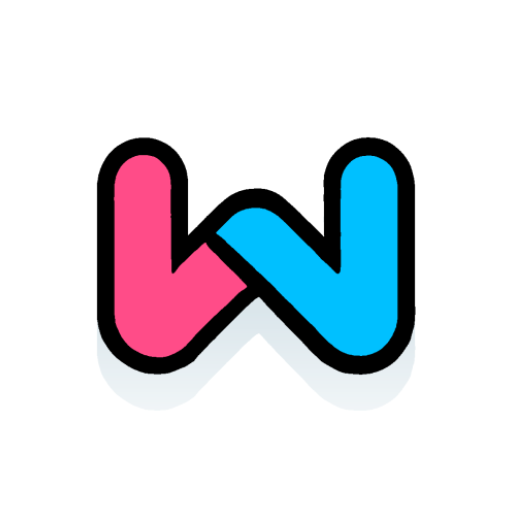

# Workyras



*Worky Relative Accumulation Saga*

Tagged, timestamp-recording, for analysis, diary app.

## Download

[APK](https://github.com/io-club/Workyras/releases)

## Usage

See [the project wiki](https://github.com/io-club/Workyras/wiki).

You may also be navigated the wiki page in browser by Workyras app:
**More** $\rightarrow$ **About** $\rightarrow$ **Help in App Usage**.
(in browser)

## Build

1. Clone this repository:
   ```bash
   git clone https://github.com/io-club/Workyras.git
   ```
2. Open the project in Android Studio.
3. Sync the Gradle files.
4. Build.

## Thanks

This project makes use of the following libraries:

- [Apache Commons Lang](https://commons.apache.org/proper/commons-lang)

  > [NOTICE](app/src/main/assets/about/licenses/notices/ApacheCommonsLang.txt)

- [MPAndroidChart](https://github.com/PhilJay/MPAndroidChart)

  > [NOTICE](app/src/main/assets/about/licenses/notices/ApacheCommonsLang.txt)

- [OpenCSV](https://opencsv.sourceforge.net/)

  > [NOTICE](app/src/main/assets/about/licenses/notices/OpenCSV.txt)

License copies:

> - [Apache 2.0](app/src/main/assets/about/licenses/copies/Apache-2.0.txt)

## Donate

You may donate to author via:

- [Bitcoin Address](bitcoin:bc1qhf4wv9l6ma5jc0lmr6mjmpfxq4gw485mwqthzn)

## License

This project is licensed under LGPL-3.0-or-later.
See the following files for details:

[NOTICE](NOTICE)

> [GPL-3.0](COPYING)

> [LGPL-3.0](COPYING.LESSER)

***

Copyright (c) 2025 IO Club


